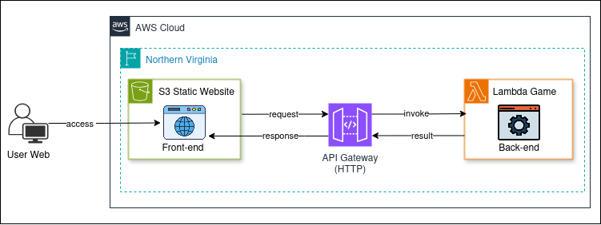

# 🎯 Jogo de Adivinhação Serverless na AWS  
Aplicação interativa web utilizando Lambda, API Gateway e S3.

---

## 📌 Visão Geral

Aplicação web interativa de adivinhação utilizando arquitetura **100% serverless** na AWS. O projeto foi desenvolvido com foco em boas práticas de **Cloud Computing**, **segurança**, **desempenho** e **custo otimizado**, utilizando serviços gerenciados da AWS.

---

## 🏗️ Arquitetura da Solução

  

### ✅ Benefícios:

- Escalabilidade automática  
- Alta disponibilidade e redundância  
- Custos otimizados (pay-per-use)  
- Separação entre frontend e backend  
- Baixa latência com distribuição global  

---

## 🧰 Tecnologias e Serviços AWS

| Camada     | Serviço                 | Função                                                |
|------------|-------------------------|--------------------------------------------------------|
| Frontend   | Amazon S3               | Hospedagem do site estático (HTML, CSS, JS)            |
| Backend    | AWS Lambda (Python 3.9) | Processamento da lógica do jogo                        |
| API        | Amazon API Gateway      | Comunicação entre frontend e backend via REST          |
| Segurança  | IAM Roles & Policies    | Controle de acesso com princípio do menor privilégio   |
| Integração | CORS                    | Comunicação segura entre origens distintas             |

---

## 🚀 Passo a Passo para Deploy

### ✅ Pré-requisitos

- Conta AWS ativa  
- AWS CLI configurado  
- Conhecimentos básicos em Lambda, API Gateway e S3  

### 📌 Etapas

1. **Criar a função Lambda**
   - Runtime: Python 3.9  
   - Código da lógica de adivinhação  
   - Configurar IAM Role com permissões mínimas  

2. **Criar API Gateway**
   - Tipo REST pública  
   - Métodos: POST ou GET  
   - Integração com Lambda  
   - Habilitar CORS  

3. **Hospedar o Frontend no S3**
   - Criar bucket com hospedagem estática  
   - Upload dos arquivos  
   - Política de bucket para acesso público de leitura  

---

## 💡 Funcionalidades

- Interface web responsiva  
- Requisições em tempo real  
- Backend serverless com Lambda  
- Comunicação segura com CORS  
- Lógica de adivinhação simples e interativa  

---

## 📚 Conceitos Aplicados

- Arquitetura orientada a eventos (Event-Driven)  
- Princípio do menor privilégio (IAM)  
- Separação de responsabilidades (desacoplamento)  
- Cloud Native Architecture  
- Integração de serviços gerenciados (DevOps)  

---

## 🌟 Competências Desenvolvidas

- Arquitetura Serverless  
- Segurança em nuvem (IAM e políticas)  
- Hosting em S3  
- Integração com API Gateway  
- Pensamento Cloud First  

---

## 📄 Licença

Este projeto é de uso educacional e demonstração de boas práticas em aplicações Serverless na AWS.
